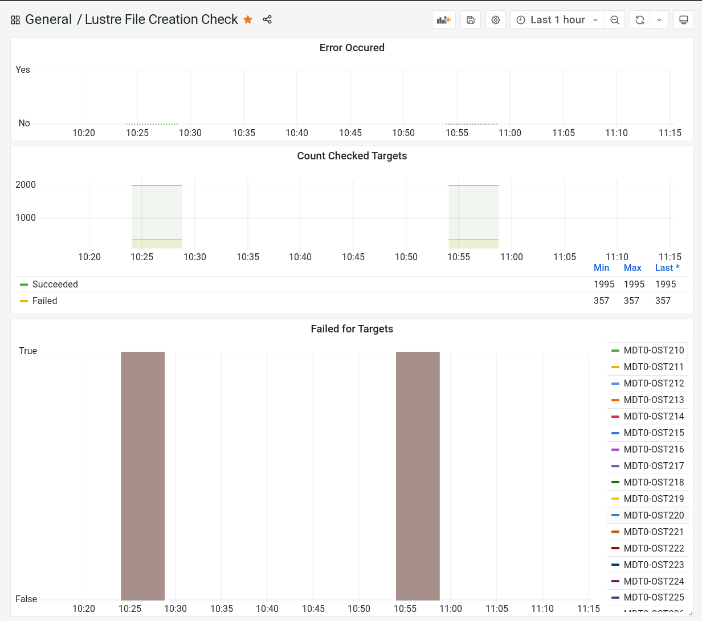

# Lustre File Creation Check

When running the Lustre filesystem not as a scratch file system,  
at some point it can happen that new files are not created on a combination of MDT+OST.  

This use case is intended to check all possible combinations of file creations between MDTs and OSTs.  

Furthermore Cyclone also supports transfering those metrics to the Prometheus monitoring system.  
To accomplish this the worker processes send the check results to an Prometheus Pushgateway client within Cyclone.  
That Pushgateway client collects those metrics and will push them bulk-wise into a Prometheus Pushgateway.

The following screenshot shows a dashboard in Grafana:  

## Configuration

### [Monitoring Task Generator](../task/generator/lustre_ost_monitoring_task_generator.py)

[Example config file for the task generator](../Configuration/lustre_ost_monitoring_task_generator.conf)

#### Section: control

| Name                 | Type   | Value                              | Description                                      |
| -------------------- | ------ | ---------------------------------- | ------------------------------------------------ |
| local\_mode          | String | yes/no, on/off, true/false and 1/0 | Specifies if local or productive mode is enabled |
| measure\_interval    | Int    | n>=0                               | Specifies the task creation time in seconds      |

#### Section: task

| Name                 | Type   | Value | Description              |
| -------------------- | ------ | ----- | ------------------------ |
| task\_file           | String | Path  | Path to task config file |
| task\_name           | String | Name  | Name of task to load     |

#### Section: lustre

| Name              | Type     | Value | Description                                                                                                     |
| ------------------| -------- | ------| --------------------------------------------------------------------------------------------------------------- |
| lfs\_bin          | String   | Path  | Path to Lustre lfs binary                                                                                       |
| target            | String   | Name  | Target name of Lustre filessytem                                                                                |
| ost\_select\_list | RangeSet | 0>=n  | List of decimal OST indexes comma separated and ranges defined with hyphen. Leave empty for all available OSTs. |

### [Task](../task/lustre_file_creation_check_task.py)

[Example config file for the task](../Configuration/lustre_ost_monitoring_tasks.xml)

| Name                         | Type     | Value | Description                                                                 |
| ---------------------------- | ------   | ------| --------------------------------------------------------------------------- |
| ost\_idx                     | Int      | -     | Placeholder, filled during runtime                                          |
| lfs\_target                  | String   | Name  | Lustre filesystem name                                                      |
| target\_base\_dir            | String   | Path  | Path to base directory for testing on Lustre                                |
| target\_mdt\_sub\_dir        | String   | Name  | Sub directory name for each MDT to test                                     |
| mdt\_index\_rangeset         | RangeSet | n>=0  | List of decimal MDT indexes comma separated and ranges defined with hyphen. |
| pushgateway\_client\_name    | String   | Host  | Specifies hostname/IP of the Pushgateway client                             |
| pushgateway\_client\_port    | Int      | Port  | Specifies the port number of the Pushgateway client                         |
| pushgateway\_client\_timeout | Int      | n>0   | Specifies the timeout in seconds for connecting to the Pushgateway client   |

### [Pushgateway Client](../cyclone-pushgateway-client.py)

[Example config file for the Pushgateway Client](../Configuration/pushgateway-client.conf)

| Name                          | Type     | Value | Description                                                                 |
| ----------------------------- | ------   | ------| --------------------------------------------------------------------------- |

[control]
pid_file      = ./Runtime/pushgateway-client.pid

[push]
interval       = 60
url            = http://localhost:9091/metrics/job/cyclone
timeout        = 15

[comm]
target       = *
port         = 5888
poll_timeout = 2

[log]
filename     = ./Runtime/pushgateway-client.log

